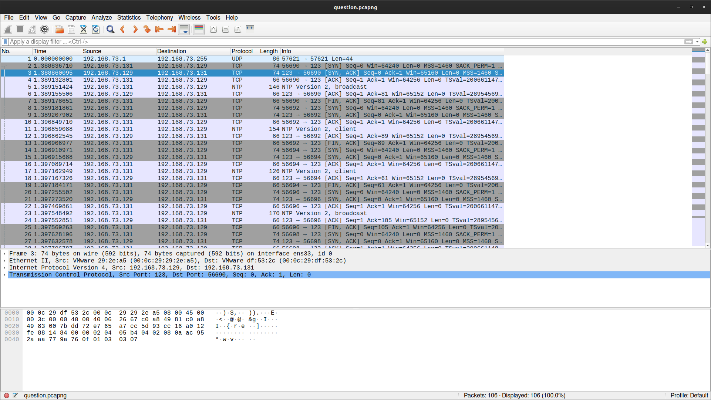
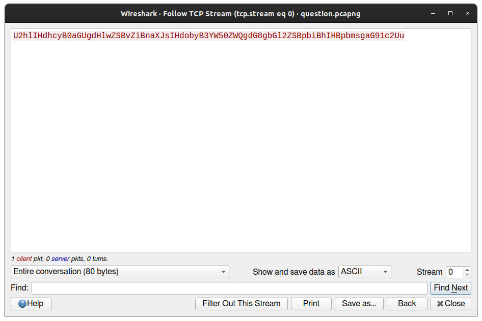
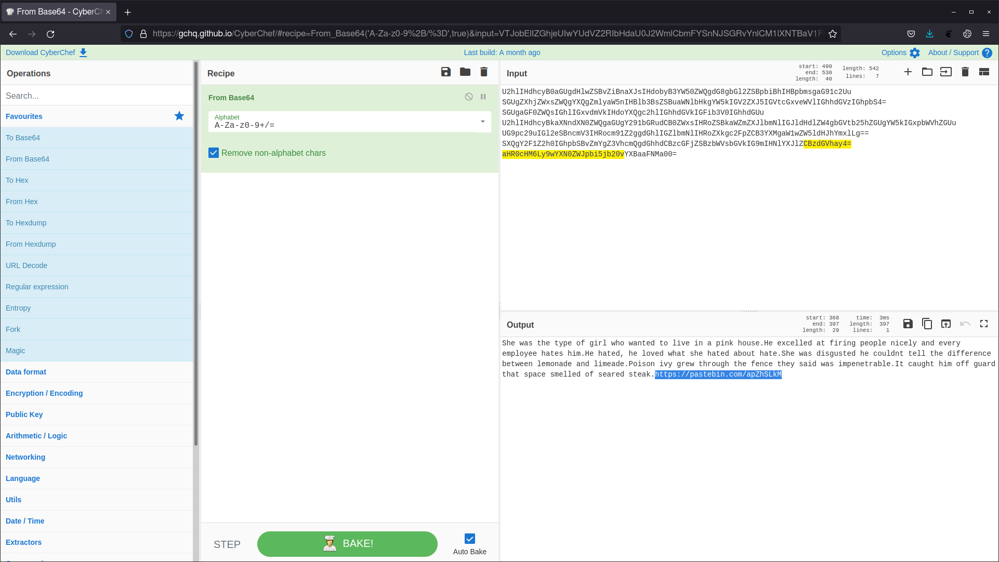
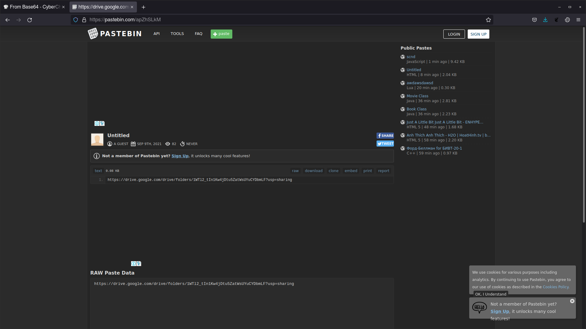
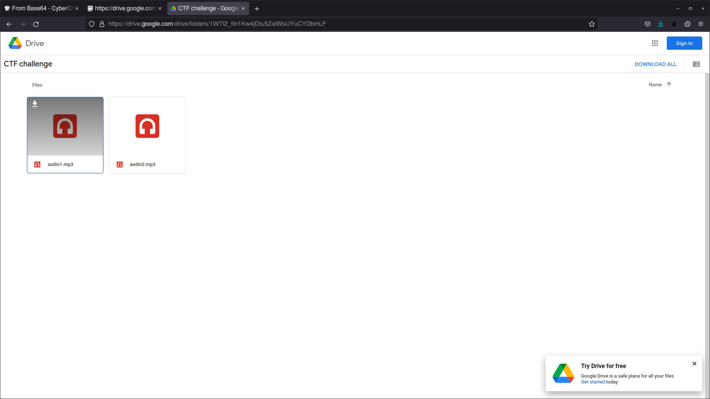
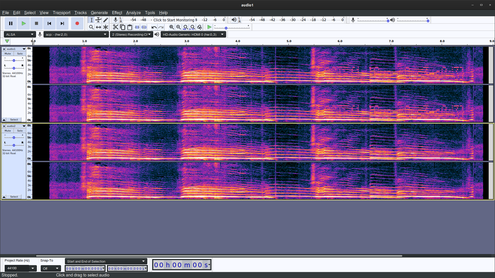
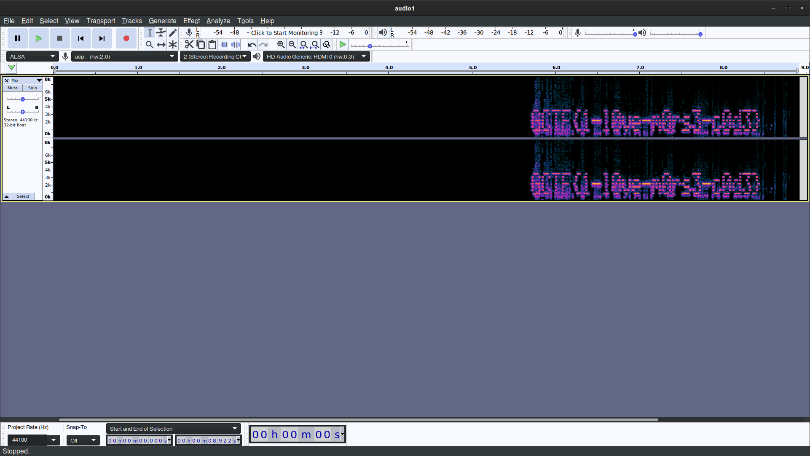

# I love steaming music
___Category:___ Forensics
## Challenge Details
I lost my music files during one of my streams, can you help me find them?
[question.pcapng](question.pcapng)
## Hint
Try inverting one of the audio track

## Write Up
After examining the given file, I've noticed that there it mostly conists of TCP packets and decided to investigate further ```Follow > TCP Stream```. Based on Stream 0, the message is encoded in Base64.



After decoding the message using [Cyberchef](https://gchq.github.io/CyberChef/) until Stream 6, a [pastebin](https://pastebin.com/apZhSLkM) link is revealed.


The link shows a [Google Drive Folder](https://drive.google.com/drive/folders/1WTl2_tIn1Kw4jDtu5ZatWsUYuCYDbmLF?usp=sharing) that contains 2 audio files.



Opening both using [Audacity](https://www.audacityteam.org/) and applying the Spectogram Layer, it can be seen that ```audio1.wav``` has a message encoded towards the end of the track. After closely examining both audio waves, it seems that both audio files are similar. 


In order to retrieve a clear vision of the message, select ```Effect > Invert``` on one of the files. Next, select both files by holding [SHIFT]. Followed by selecting ```Tracks > Mix > Mix and Render```.


Flag:
```sh
GCTF{1-l0ve-m0rs3-c0d2}
```