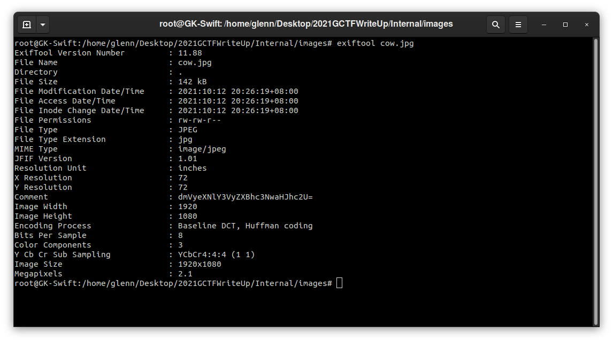
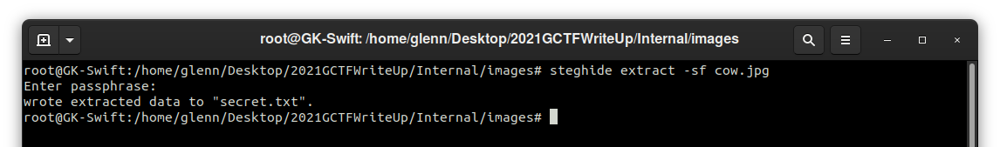
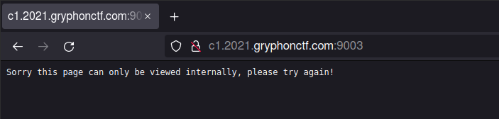
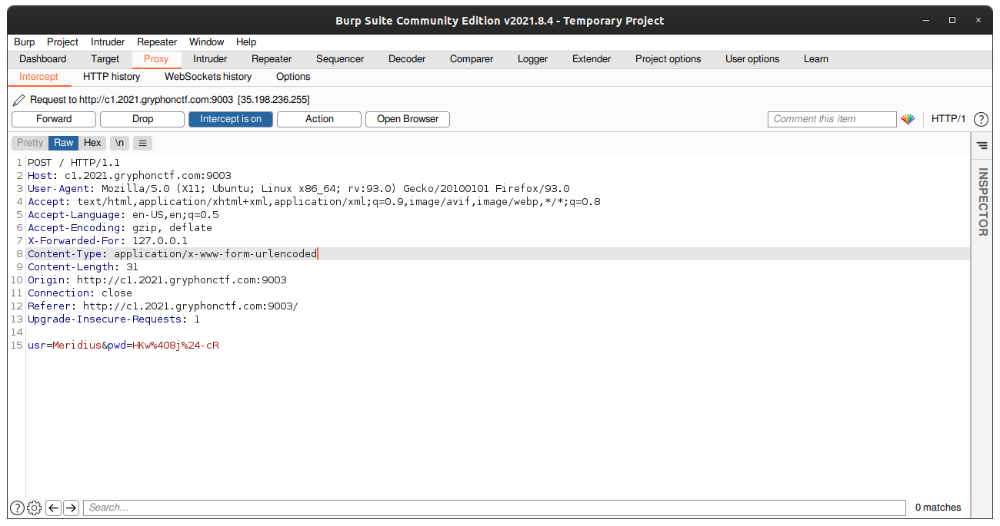
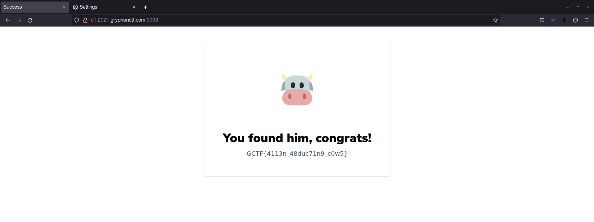

# Internal
___Category:___ Web Exploit
## Challenge Details
The aliens have abducted the cow... can you help us find him?
[http://c1.2021.gryphonctf.com:9003/](http://c1.2021.gryphonctf.com:9003/)
## Hint
🛸 🐄

## Write Up

Upon inspecting the website, nothing seems to be of suspicion. However, after downloading the image ```/images/cow.jpg```, it appears that there is an encoded message in the meta data.
Looking at ```Comment : dmVyeXNlY3VyZXBhc3NwaHJhc2U=```, it is obvious that the message is encoded in Base64.
Decoded message: ```verysecurepassphrase```


Using the text phrase retrieved earlier as the password, ```secret.txt``` was extracted from ```cow.jpg``` using [Steghide](steghide.sourceforge.net)


secret.txt:
>Meridius:HKw@8j$-cR

When loggining with the credentials ```Username: Meridius``` and ```Password: HKw@8j$-cR``` this is the result


To bypass this, the originating IP Address has to be modified. Using [Burp Suite](https://portswigger.net/burp), I've captured the request and inserted ```X-Forwarded-For: 127.0.0.1``` which would allow me to spoof the request.




## Flag:
```
GCTF{4113n_48duc71n9_c0w5}
```
