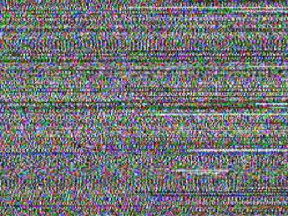
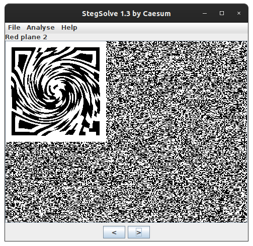
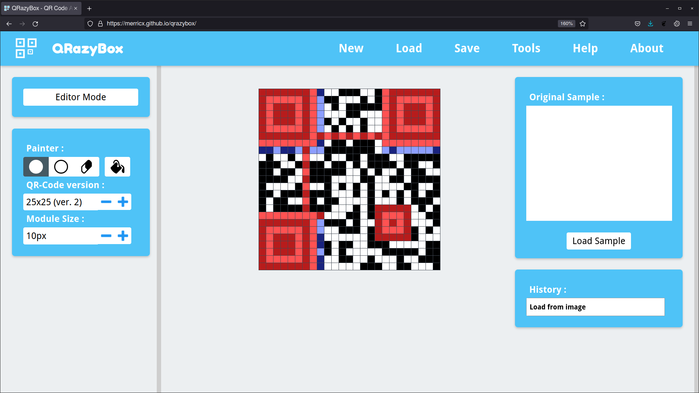
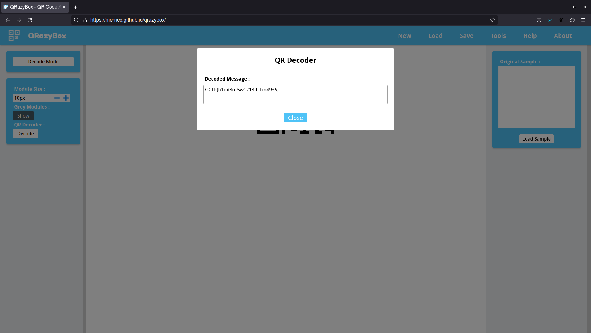

# Static
___Category:___ Misc
## Challenge Details
swish swoosh  


## Write Up
Initially, the given image looks like static and nothing can be deciphered. However, using a tool such as [StegSolve](https://github.com/eugenekolo/sec-tools/tree/master/stego/stegsolve/stegsolve), I noticed that a manipulated QR Code can be seen at ```red plane 2```.  


The image is then cropped and can easily be "unswirled" using [Gimp](https://www.gimp.org/).
After opening the image, navigate to ```Filters > Distorts > Whirl and Pinch...``` and adjust until the QR Code is fairly visible.  


Obviously the QR Code is not readable yet. Using an online tool like [Qrazybox](https://merricx.github.io/qrazybox/), I was able piece out and restore the image.  


When finished, Qrzazy box is also able to decode the QR Code which revealed the flag.  


## Flag:
```
GCTF{h1dd3n_5w1213d_1m4935}
```
