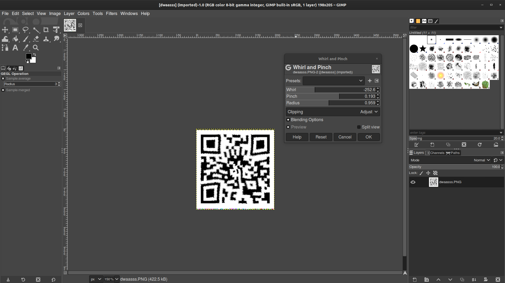

# swish swoosh
___Category:___ Misc
## Challenge Details
swish swoosh


## Write Up
The given image can easily be "unswirled" using [Gimp](https://www.gimp.org/).
After opening the image, navigate to ```Filters > Distorts > Whirl and Pinch...``` and adjust until the QR Code is fairly visible.


Obviously the QR Code is not readable yet. Using an online tool like [Qrazybox](https://merricx.github.io/qrazybox/), I was able piece out and restore the image.


When finished, Qrzazy box is also able to decode the QR Code which revealed the flag.


## Flag:
```sh
GCTF{h1dd3n_5w1213d_1m4935}
```