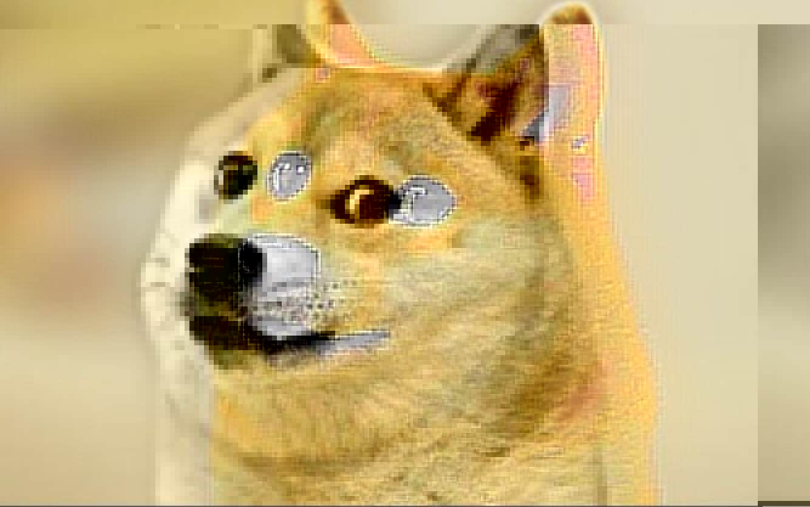

# Thirteen Doges
___Category:___ Forensics
## Challenge Details
Here's a pic of good ol' Doge. The one and only. Or is it?
Ensure to have a 7-zip or WinRAR extractor installed to be able to solve this problem.  


## Write Up
Looking at the hexdump using a tool such as [GHex](https://github.com/GNOME/GHex), it appears that the file contains multiple images.  


Binwalk was used to extract the contents.
```binwalk -e doge.jpg```  


Navigating to the extracted folder, all images looks similar except for ```dog7.jpg```.  


Using [GHex](https://github.com/GNOME/GHex) again, I noticed an expression that looks similar to the flag and copied it ```TPGS{q0t3p01a}```.  


Pasting the text into an online [cipher identifier](https://www.dcode.fr/cipher-identifier) tool, it shows that the best match was [ROT Cipher](https://en.wikipedia.org/wiki/ROT13).  


Next, [Cyberchef](https://gchq.github.io/CyberChef/) decrypted the text using ROT13 and revealed the flag.  


## Flag:
```sh
GCTF{d0g3c01n}
```
