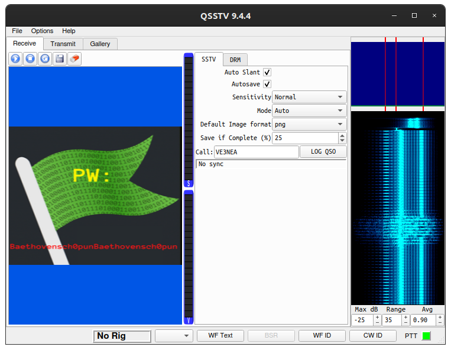

# UnlockTheFile
___Category:___ Misc
## Challenge Details
Help Melody to find her ID to unlock the confidential file!
- [audio.wav](files/audio.wav)
- [encrpyt.py](files/encrypt.py)
- [myflag.txt.en](files/myflag.txt.en)

## Write Up
Based on an analysis of ```encrypt.py``` a password is needed to decrypt ```myflag.txt.en```. After using [Sonic Visualizer](https://www.sonicvisualiser.org/) and trying DTMF decoder, nothing can be devrived to form a password. Finally, I have concluded that the ```audio.wav``` was encoded using [SSTV](https://en.wikipedia.org/wiki/Slow-scan_television).

```sh
apt-get install qsstv
pactl load-module module-null-sink sink_name=virtual-cable
apt-get install pavucontrol
pavucontrol # A GUI will pop-up, go to the "Output Devices" tab to verify that you have the "Null Output" device. 
qsstv # The program GUI will pop-up, go to "Options" > "Configuration" > "Sound" and select the "PulseAudio" Audio Interface
```
```sh
pavucontrol #return back to pavucontrol > Recording and ensure that QSSTV is using "Null Output"
paplay -d virtual-cable audio.wav
```

From the image, the password is revealed as ```Baethovensch0punBaethovensch0pun```.


To decrypt the file and retrieve the flag, this block of code is inserted to ```encrypt.py```
```python
elif sys.argv[1] == "-d":
    pwd = "Baethovensch0punBaethovensch0pun"
    ssb_b64 = base64.b64encode(pwd.encode())
    c = Fernet(ssb_b64)

    with open(sys.argv[2], "rb") as f:
        data = f.read()
        data_c = c.decrypt(data)
        sys.stdout.write(data_c.decode())
```

Running the program would reveal the flag.
```sh
python3 encrypt.py -d myflag.txt.en 
```

## Flag:
```
GCTF{FA1r_Pr!c3_5elf_cHeck0u7}
```
